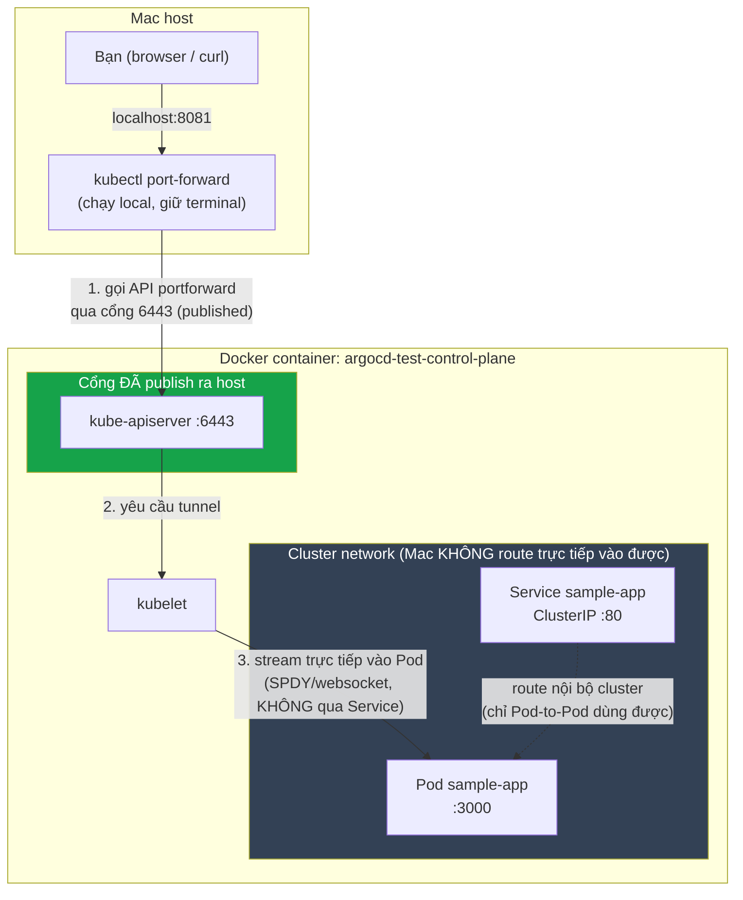
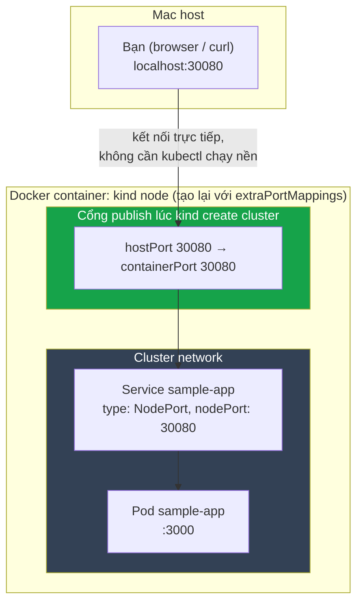

# Network flow: Docker → kind → Kubernetes

## Hiện trạng: chỉ port 6443 được Docker publish ra host

**Điểm mấu chốt:** port-forward không đi qua Docker port-mapping của Service. Nó tunnel qua đúng 1 cổng đã published (6443) bằng cách nhờ kube-apiserver + kubelet chuyển tiếp stream thẳng vào Pod. Vì vậy nó "xuyên" được vào cluster dù chỉ có 1 cổng lộ ra ngoài — nhưng tunnel này sống theo tiến trình `kubectl`, tắt là mất.

## Muốn NodePort thật (không cần giữ terminal): phải publish port lúc TẠO container

**Khác biệt cốt lõi:** Docker chỉ cho publish port **lúc container được tạo** (`docker run -p` / kind's `extraPortMappings`), không thể thêm port-mapping vào container đang chạy. Vì cluster kind hiện tại được tạo mà không khai báo `extraPortMappings`, nên phải `kind delete cluster` + tạo lại với config mới để dùng NodePort mà không cần port-forward.
